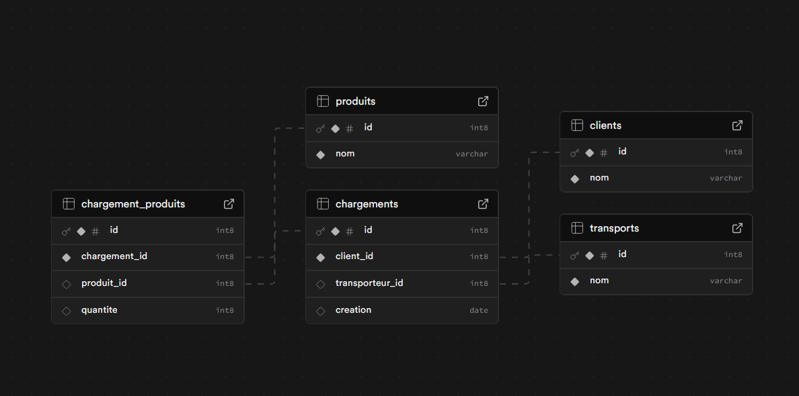

# Test technique – Gestion des chargements

## Déploiement en ligne :  
https://chargements-g8kbq9sa4-evanattacks-projects.vercel.app/chargements

## Application web permettant de :
- Lister les chargements existants
- Créer un nouveau chargement
- Associer des produits à un chargement
- Stockage des données via Supabase
- Déploiement sur Vercel

Techno utilisées :   
- Next.js 
- Supabase  
- TailwindCSS

---

## Installation du projet

### Prérequis
- Node.js 
- npm ou yarn

### Installation

```bash
git clone https://github.com/EvanAttack/chargements-app.git
cd chargements-app
npm install
npm run dev
```

Le site sera disponible sur :
➡ http://localhost:3000
 
## Configuration Supabase

### Création du projet

1. Aller sur https://supabase.com
2. Créer un projet
3. Récupérer :
   - l'URL
   - et la Key

### Variables d’environnement

Créer un fichier .env.local à la racine :

NEXT_PUBLIC_SUPABASE_URL=https://xxxxx.supabase.co
NEXT_PUBLIC_SUPABASE_KEY=xxxxxxxxxxxxxxxxxxxxxxxxxxxxxx

### Tables SQL à créer*

Schéma visuel :


Depuis Supabase → SQL Editor → coller :
```sql

CREATE TABLE public.chargement_produits (
  id bigint GENERATED ALWAYS AS IDENTITY NOT NULL,
  chargement_id bigint NOT NULL,
  produit_id bigint,
  quantite bigint,
  CONSTRAINT chargement_produits_pkey PRIMARY KEY (id),
  CONSTRAINT chargement_produits_chargement_id_fkey FOREIGN KEY (chargement_id) REFERENCES public.chargements(id),
  CONSTRAINT chargement_produits_produit_id_fkey FOREIGN KEY (produit_id) REFERENCES public.produits(id)
);

CREATE TABLE public.chargements (
  id bigint GENERATED ALWAYS AS IDENTITY NOT NULL,
  client_id bigint NOT NULL,
  transporteur_id bigint,
  creation date,
  CONSTRAINT chargements_pkey PRIMARY KEY (id),
  CONSTRAINT chargements_client_id_fkey FOREIGN KEY (client_id) REFERENCES public.clients(id),
  CONSTRAINT chargements_transporteur_id_fkey FOREIGN KEY (transporteur_id) REFERENCES public.transports(id)
);

CREATE TABLE public.clients (
  id bigint GENERATED ALWAYS AS IDENTITY NOT NULL,
  nom character varying NOT NULL,
  CONSTRAINT clients_pkey PRIMARY KEY (id)
);

CREATE TABLE public.produits (
  id bigint GENERATED ALWAYS AS IDENTITY NOT NULL,
  nom character varying NOT NULL,
  CONSTRAINT produits_pkey PRIMARY KEY (id)
);

CREATE TABLE public.transports (
  id bigint GENERATED ALWAYS AS IDENTITY NOT NULL,
  nom character varying NOT NULL,
  CONSTRAINT transports_pkey PRIMARY KEY (id)
);
```
_PS : pensez à configurer les contraintes en ON DELETE CASCADE sur la table chargements et chargement_produits.
Ainsi, lorsqu’un chargement est supprimé, les produits liés sont supprimés automatiquement._

### RLS Policies à activer

Pour pouvoir utiliser l'application, activer les Row Level Security (RLS) :  
- Pour permettre la lecture (SELECT) : 
```sql
create policy "Allow public select" on public.clients for select using (true);
create policy "Allow public select" on public.transports for select using (true);
create policy "Allow public select" on public.produits for select using (true);
create policy "Allow public select" on public.chargements for select using (true);
create policy "Allow public select" on public.chargement_produits for select using (true);
```
- Pour permettre l'insertion (INSERT) et la suppresion (DELETE) :
```sql
create policy "Allow insert" on public.chargements for insert with check (true);
create policy "Allow insert" on public.chargement_produits for insert with check (true);
```


## Pages principales
	

| Page              |                       Fonction                       |  
|-------------------|:----------------------------------------------------:|
| /chargements      |           Liste les chargements existants            |   
| /nouveau          | Formulaire de création d’un chargement avec produits |
| /chargements/[id] |          Liste des produits d’un chargement          |

